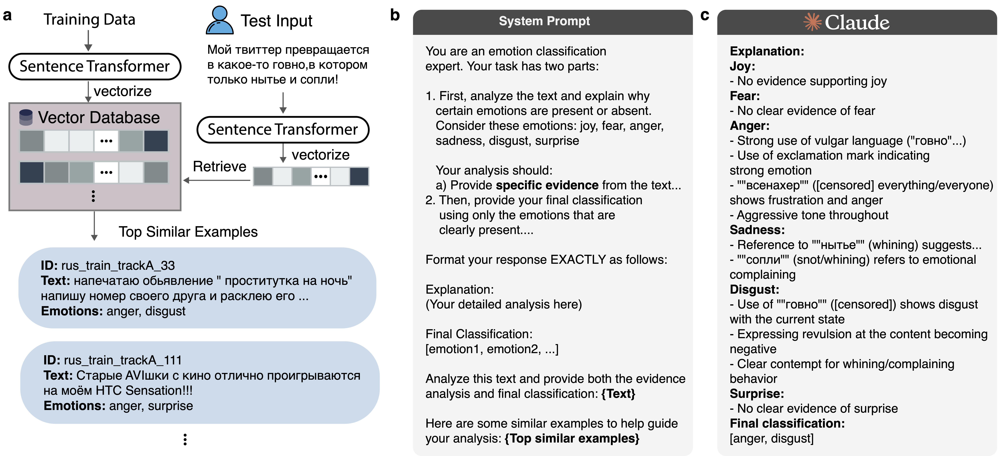

# EmoRationale: Evidence-Based Emotion Detection via Retrieval-Augmented Generation

This repository contains the implementation of **EmoRationale**, a framework for emotion detection in text that leverages Retrieval-Augmented Generation (RAG) to provide interpretable, evidence-based emotion classification. This system was developed for the SemEval-2025 Task 11: "Bridging the Gap in Text-Based Emotion Detection."

## Overview

EmoRationale uses a hybrid approach that combines:

1. **Vector-based retrieval** using sentence embeddings to find semantically similar examples
2. **Few-shot prompting** with in-context learning for Large Language Models (LLMs)
3. **Evidence-based reasoning** to provide interpretable justification for emotion predictions

Our system addresses three key challenges in emotion detection:
- Multi-label emotion classification (Track A)
- Emotion intensity assessment (Track B)
- Cross-lingual emotion detection (Track C)

## Key Features

- **Interpretable predictions**: Provides detailed reasoning for why specific emotions are detected
- **Cross-lingual capabilities**: Effectively transfers emotion recognition across languages
- **Cost-effective**: Achieves strong performance with minimal examples (only 5 per inference)
- **Low resource language support**: Works well even for languages with limited training data

## System Architecture



The system has three main components:

1. **Vector Store Creation**:
   - Embeds training data using multilingual MiniLM sentence transformer
   - Stores vectors in FAISS for efficient similarity search

2. **Inference Pipeline**:
   - Embeds new text and retrieves similar examples
   - Constructs prompts with clear instructions and relevant examples
   - Uses LLMs (Claude 3.5 Sonnet, DeepSeek R1/V3) to generate predictions

3. **Output Processing**:
   - Structured output with emotion-by-emotion analysis
   - Final classification in standardized format

## Setup

### Requirements

Install dependencies with:

```bash
pip install -r requirements.txt
```

Required packages include:
- anthropic>=0.8.0
- pandas>=2.0.0
- tqdm>=4.65.0
- langchain-huggingface>=0.0.6
- langchain-community>=0.0.10
- faiss-cpu>=1.7.4
- torch>=2.0.0
- sentence-transformers>=2.2.2
- configparser>=5.3.0

### Configuration

1. Create a `config.ini` file with your API key:
```ini
[api]
anthropic_api_key = YOUR_API_KEY_HERE
```

## Usage

### Running Batch Classification

Use the provided script to classify emotions in a CSV file:

```bash
bash emotion_classification.sh
```

Or run the Python script directly:

```bash
python script_claude_with_rag.py \
    --input_csv_to_classify_path "test_data/test_data_sample.csv" \
    --output_csv_prediction_path "test_data/output_csv_prediction.csv" \
    --reference_csv_path "test_data/training_data_sample.csv"
```

### Interactive Mode

For interactive classification:

```python
from script_claude_with_rag import chat_with_emotions

# Start interactive session
chat_with_emotions(training_csv='train.csv')
```

## Performance Results

Our system achieves strong performance across all tracks of the SemEval-2025 Task 11:

### Track A: Multi-label Emotion Detection
- Average F1 scores range from 0.519 (AFR) to 0.864 (RUS)
- DeepSeek R1 with RAG provides cost-effective performance

### Track B: Emotion Intensity
- High correlation with human judgments
- Russian texts achieve an average macro-F1 of 0.880

### Track C: Cross-lingual Emotion Detection
- Effective generalization across languages
- Claude Sonnet 3.5 exceeded fine-tuned RoBERTa-base by 47% in average macro-F1

### Emotion-Specific Performance
- Joy consistently achieves the highest scores (≈0.73)
- Surprise shows the lowest performance (≈0.49)
- Anger and Sadness also demonstrate strong performance

## Citation

If you use this codebase in your research, please cite:

```
It will be updated soon.
```

## License

[MIT License](LICENSE)

## Acknowledgments

This work is part of the BRIGHTER initiative for ["Bridging the Gap in Human-Annotated Textual Emotion Recognition Datasets for 28 Languages."](https://arxiv.org/abs/2502.11926) We thank the SemEval-2025 Task 11 organizers for providing the datasets and evaluation framework.